# YOLOv5 based Open-Source UAV for human detection during Search And Rescue(SAR)

## ABSTRACT

Floods are among the most frequently occurring natural disasters. They account for high mortality rates due to their rapidness and uncertainty of occurrence. Inundated lands require a quick response for rapid evacuation, arresting fatalities, and consequential economic losses. People tend to seek shelter at dry lands and terraces of their homes at times of calamity. The manual Search and Rescue (SAR) operations have their shortcomings due to the difficulties in identifying the human presence. It requires a longer time for evacuation and therefore increased mortalities. This report proposes a quadcopter for real-time monitoring of isolated places and automatically detecting stranded humans during floods using image processing techniques at affordable rates. Live video streaming is possible with a camera and a video transmission system attached to the quadcopter. The rescue centers automatically receive the location of humans in case of human detection. Our model integrates an Open-Source autopilot system model, APM 2.8 multicopter flight controller that efficiently stabilizes the flight, and a YOLOv5 object tracking convolutional neural network algorithm for faster detection of human beings. The model is trained using a dedicated dataset of more than 1000 images and attains 0.954 mAP. We have developed a drone using open-source hardware and software tools, conducted test flights to check its stability and the efficiency of the object detection algorithm. We also conducted a mini-survey of one of the most flood-prone areas of Thrissur district in Kerala, using Mission Planner open-source software to evaluate how quickly our drone can assess the entire area. The aim is to save more human lives by quick and efficient aerial assessment in the most cost-efficient manner.

## CONSTRUCTION AND CALIBRATION OF DRONE HARDWARE 

The components for building the quadcopter were chosen after a series of calculations. Calibration of the drone was done on Mission planner software.

Quadcopter Frame

The copter has a F450 frame and landing gear built from quality glass fiber and polyamide nylon. This makes the frame light as well has rigid enough to carry LiPo battery, controller, 4 BLDC motors, ESCs, and payloads. The copter has a 4-axis frame with 450 mm width and 55 mm height. It includes integrated PCB connections for direct soldering of ESCs. The arms are colored for orientation to help in flying in the right direction.

Propeller

For the quadcopter, two clockwise and two anticlockwise 1045 SF Propellers are used. It has a length of 10inch, pitch of 4.5inch, shaft Diameter of 6 mm and 15° angle design. The 15° angle design in the end of the propeller to avoid whirlpool multi-copter flying.
This 1045 propeller can be used with brushless motors with a 800-2200 kV rating. They have wide and thin blades in their size category which makes them much flexible in crash conditions where they do not break easily. 1045 (10 × 4.5) SF Propellers Black especially draws larger currents and in results will give you a considerable amount of thrust. They are for lower RPM motor and slow flying drone models.

Flight Controller

The flight controller is a circuit board with a range of sensors that detect drone movement as well as user commands and makes the drone move as instructed. The main component that functions as the brain of the quadcopter is the flight controller. The model chosen for our quadcopter is APM 2.8 Multicopter Flight Controller.
It is a complete open source autopilot system which has a variety of built-in sensors like, compass UBLOX LEA-6H, 3-axis gyrometer MPU-6000, a high-performance barometer MS5611-01BA03, InvenSense’s 6 DoF Accelerometer and an onboard 4 Megabyte DataFlash chip for automatic data logging and also an optional off-board GPS. For external GPS, it has APM serial port and an I2C port. They help in collecting information about the height, direction and speed of the drone. It uses ATMEGA32U-2 and ATmega2560 chips for USB functions and processing respectively. The controller is used to vary the speed of the motors and monitor battery levels, control the GPS module, radio and video telemetries. APM 2.8 has 13 analog pins and uses the same set of 9 analog input pins as digital output pins. 

Electronic Speed Controller

The Electronic Speed Controller (ESC) in the drone is an electronic circuit that translates what a pilot’s controls into precise instructions sent to the motors to control movement. The quadcopter uses SIMONK 30A BLDC Electronic Speed Controller. It works on 2S-3S LiPo batteries and is specifically made for quadcopters and multi-rotors to provides faster and better motor speed control giving better flight performance. For a brushless motor, the speed of the motor will depend on the frequency of the winding drive sequence. On a basic brushless motor, there are three windings that are controlled using pulse width modulated (PWM) signals. Two windings will be driven at a time to create the necessary magnetic forces to turn the rotor. The greater the frequency sent to the motors, the faster the rotor will turn due to the magnetic forces. The frequency of the signals is adjusted by changing the pulse width of the signal. This PWM signal is given to the BLDC motor from the APM with the help of ESCs. 
Simonk 30A BLDC ESC Electronic Speed Controller can drive motors which consume current up to 30A. It works on 2S-3S LiPo batteries. This electronic speed controller offers a battery eliminator circuit (BEC) that provides 5V and 2A to the receiver so we don’t need extra receiver battery. ESCs connect the APM to the BLDC motor This version of the ESC also includes backwards-polarity protection and protection on the 5V receiver line, this means that if you accidentally attach a battery backward it won’t destroy your motor controller and other BECs won’t affect the ESC.

Electric Motor

Brushless DC (BLDC) motors are suitable for quadcopter since they have better speed vs torque characteristics, high efficiency with noiseless operation and very high-speed range with longer life. The motor chosen is A2212 - 1000 kV BLDC motor with a Thrust value of 800 gwt at 3S with a 1045 propeller. It is a high-speed brushless motor designed specifically for Quadcopters, Drones or toy planes. The motor is OUTRUNNER type where outside case rotates while inside stays fixed. The naming for the brushless motor 2212/13T 1000kV is shown in the table.
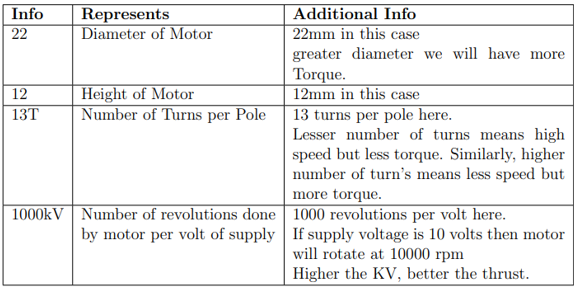

GPS Module

A GPS receiver passively retrieves this data from multiple satellites to estimate its position. Network of satellites transmits data about its current location and time. By estimating the distance between more than three satellites, a GPS receiver can determine its current position in three dimensions. The GPS chosen for our system is Neo 7M GPS module.
It is a high sensitivity, low power GPS module that includes an HMC5883L digital compass.  The GPS module has 56 channels and outputs precise position updates at 10Hz.  Neo 7M includes two cables, a 6pin connector for the GPS module and a 4-pin connector for the I2C compass connection to the APM.

Power Module

The Power Module provides the APM 2.8 power from LiPo battery as well as current consumption and battery voltage measurements, all through a 6-pos cable. The on-board switching regulator outputs 5.3V and a maximum of 2.25A from 2S-6S LiPo battery. The Power Module has deans connectors, and wrapped in shrink tubing for protection. It can power APM, an RC receiver, GPS and telemetry.

FPV Camera

The FPV camera chosen is Foxeer Razer Mini 1200TVL 2.1mm FPV Camera. The Foxeer Razer Mini is a great camera for those seeking good performance in a low light environment. It features a 1200TVL definition with an advanced natural image. Few of the specs of the camera are mentioned in the table.
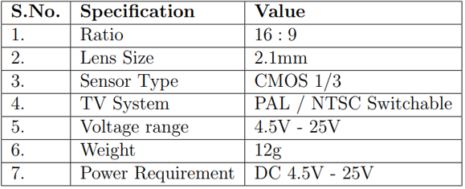

 FPV transmitter 

An FPV transmitter is an analogue video transmitter by which downlinks the video from the FPV camera to view the video on a screen, googles or portable monitor. FPV video receivers are a critical part of the FPV system. Video receivers work to turn the RF signal from the drone into clear video for displaying. The figure shows TS832 5.8GHz 48 channels 600MW Transmitter (TX) Module and FPV Mini 5.8GHz 150CH Receiver (RX) has been chosen for our system. The receiver obtains output signal which is an AV analog signal which has the video format: NTSC / PAL Auto. The receiver also has an OTG type r A RC Transmitter is required to direct the quadcopters direction and position. A RC radio receiver on the quadcopter receives commands from the RC transmitter on the ground. Once the transmitter and receiver locked together, the transmitted signal is spread out over a wide band before being identified, collected and re-assembled by the receiver. FlySky CT6B 2.4GHz 6CH Transmitter with FS-R6B Receiver was chosen. 
It is a 6-channel radio having Bandwidth of 500 kHz with full range of 2.4GHz. This radio has two retract switches and proportional flap dials in easy reach for channels 5 and 6. It is used to manually control the drone’s movement (throttle) and orientation (pitch, roll, and yaw). The control commands are mapped into PWM (multi-channel) or Pulse Position Modulation (PPM) (single channel) signals and transmitted to the flight controller. Afterwards, the controller used them to control the drone’s motor.

Telemetry

Telemetry is used to retrieve flight information of drone on the computer or radio control in order to follow several parameters of your aircraft on the ground. It allows one to observe the vehicle performance parameters and its current position. 3DR Radio Telemetry 433MHz 500mW telemetry set was used for of system. 
This radio telemetry set has separate Air & Ground module. The telemetry set allows you to link to an APM to a USB or UART equipped device such as a computer, laptop or tablet supporting a USB connection (OTG). This radio telemetry set has separate Air & Ground module. It’s transceivers can use UART or USB connections and support both modes. The Radio set allows to see live data, such as live GPS position overlaid on a map, system voltage, heading, waypoint navigation and much more. The specifications of the telemetry is shown in the table.
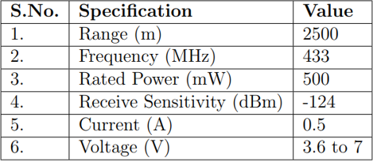

LiPo Battery

Lithium Polymer Battery Packs are chosen due to its high energy density and discharge capability. It will last between 300 and 500 charge cycles. LiPo batteries can hold 30% more capacity and are much lighter than a Nickel Metal Hydride (NiMH) battery. After a series of calculations, we chose 4200mAh 3S 35C (11.1 V) Lithium Polymer Battery Pack (LiPo).
It is a type of rechargeable battery of 11.1V and having a capacity of 4200mAh which can power the quadcopter and provide sufficient flight time. It has XT60 output connector which is equipped with heavy-duty discharge leads to minimize resistance and sustain high current loads.

## CONNECTION DIAGRAM

The  figure   shows  the  detailed  connection  diagram  of  the  drone hardware.The  circuit  mainly  consist  of  a  flight  controller  which  acts  as  the brain of the quadcopter.  The flight controller APM 2.8 is powered from 11.1V LiPo  battery  with  power  module.   It  takes  PWM  signals  as  input  from  the  6-channel  receiver,  which  receives  signals  at  2.4GHz  from  radio  transmitter.   All the  BLDC  motors  are  connected  to  the  flight  controller  via  ESCs  (ElectronicSpeed Controller).  In addition to these, we use an FPV transmitter and an FPV camera  which  are  powered  by  5V  to  obtain  live  video.   This  video  is  used  for processing and object detection.  The external GPS has 2 pin connection to I2C and  4  pin connection  to  GPS.  Telemetry  air module is  connected  to  the  APM with 4 serial connections (Tx, Rx, 5V and GND).

## WORKING 
A brief step-wise explanation of the flowchart given in figure is given below :
1.  Power the APM Flight controller of the quadcopter by the LiPo battery forgetting sufficient flight time.
2.  Load  the  Mission  Planner  software  into  the  APM  autopilot  board  and establish the connection between the flight controller and Mission Planner software.  With proper telemetry hardware, Mission planner software helps to  monitor  the  quadcopter’s  status  while  in operation,  analyze  telemetry logs and operate the quadcopter.
3.  Read the GPS coordinates of the quadcopter by which it is able to monitorand analyze the telemetry logs.
4.  Arm the flight controller of the quadcopter with the help of an RC controller.
5.  Run the human detection YOLOv5 program which yields the live video feed captured by a camera mounted on the quadcopter and transmitted to the Ground Control Station by the video transmitter-receiver pair.
6.  Now, by controlling the quadcopter with the RC controller, quadcopter can be directed to assess different flooded regions.
7.  If  humans  are  detected  ,  then  their  presence  is  identified  by  bounding boxes drawn over them.Otherwise, quadcopter is made to move to differentlocations for obtaining the live video feed.
8.  In  case  humans  are  detected  their  GPS  coordinates  are  stored  in  the database.
9.  On completing the assessment of the targeted flooded area, drone is made to land and the human detection program is stopped.
10.  Disarm the flight controller and the stored GPS coordinates are mailed tothe respective authorities.  A map pinpointing the humans detected is alsogenerated the end of the program.
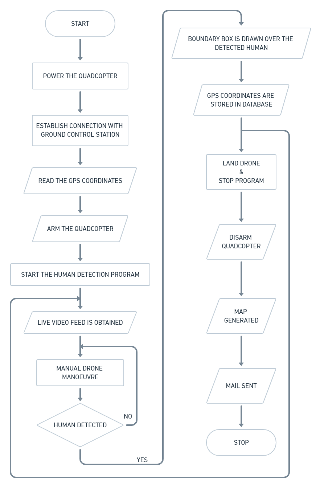
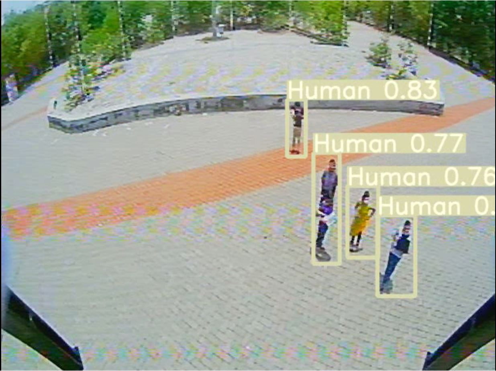
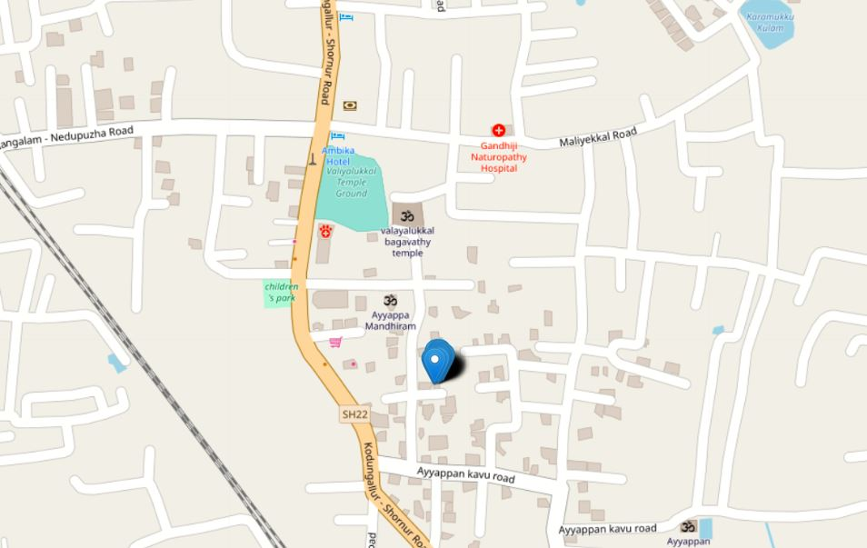

## DATASET DEVELOPMENT 

The custom dataset proposed for close range aerial human detection for our project contains 1028 distinctive images with 2794 human instances of different actions. The data was collected from various locales using a drone equipped with an analog FPV camera at a height of 8m. The footage provided videos with 640 x 480 pixel format at 60 fps. The dataset comprises of scenarios of a group of humans carrying out different actions at different angles and orientations to make it compatible for real time applications. The dataset initially recorded in the form of a video was converted to images by extracting frames using OpenCV and every 10 frames were skipped to avoid repetition. Image annotation was done using a browser based online software called Roboflow and was annotated for only one class titled "Human" as the main objective is human detection.

## HUMAN DETECTION

The Human detection and GPS data acquisition at the instant of identification is performed at the ground control station on a PC. With the help of a camera mounted on the quadcopter, a live video feed is obtained, that is used to detect stranded people using a human detection program that uses a model that is trained using YOLO v5 algorithm. The figure below shows a snapshot of real time human detection performed by the model on the footage captured by the drone.
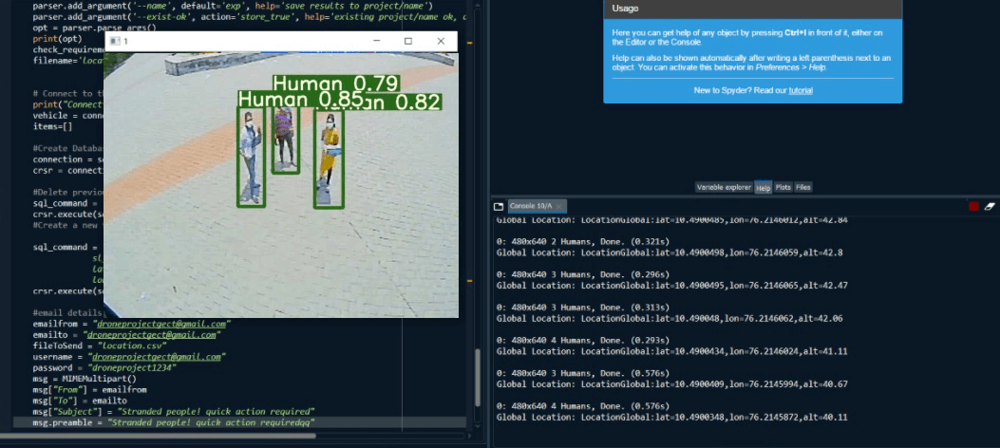

 
YOLO is a state-of-the-art, open-source real-time object detection system.We use the latest version of YOLO (YOLO v5) algorithm to train our detection model. This version has unique features employed like Mosaic augmentation, 16 bit floating point precision and adaptive anchor boxes which improve the model generalisability, inference speed, accuracy and overall robustness of the model. We used the version YOLOv5s in this project. The training details of the model is given in table below. 
 
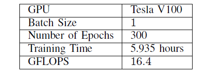

The setup establishes a connection with the drone, loads the trained model and utilizes the trained weights to detect humans and limit boxes for them. Then it extracts frames from the video feed obtained from the drone camera and proceeds to detecting humans. After detection, the predicted bounding boxes are drawn onto the image and the footage containing the detected results.

 

RESULTS OF TRAINING 

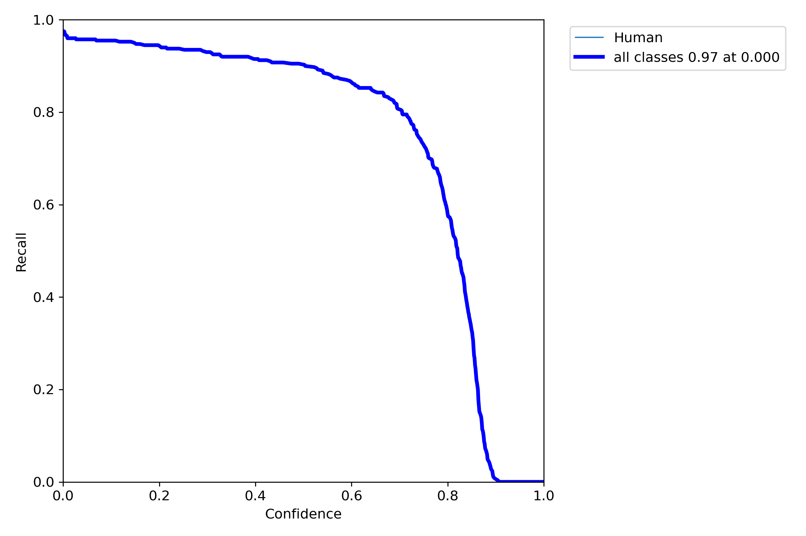
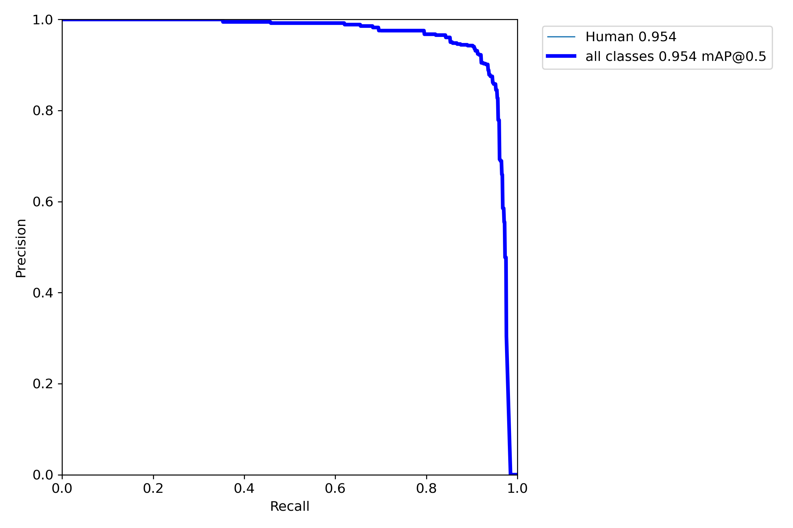
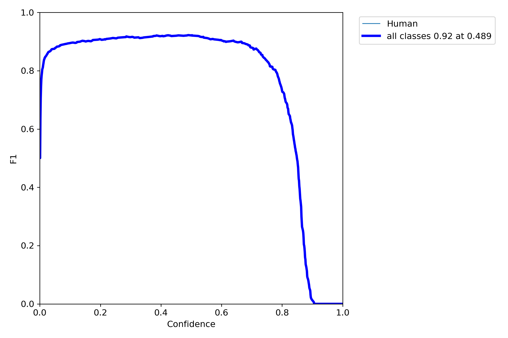
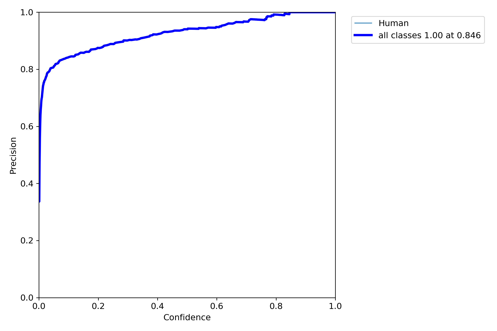

